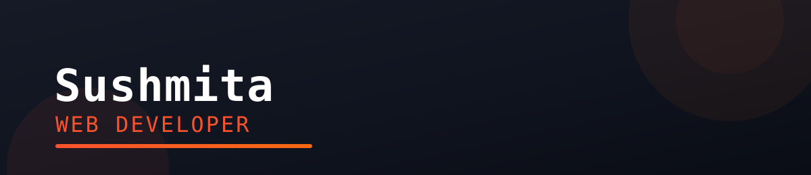

  

  

  
  
  
  
  
  
  
  
  

---

## 👋 About Me

- 🎓 I am a BCA student
- 💼 Currently learning **Python, Django and PostgreSQL**
- 📫 Reach me at: **tsushmi436@gmail.com**

## 📊 GitHub Stats

  

  

## 🤝 Connect with Me

  
  

  

